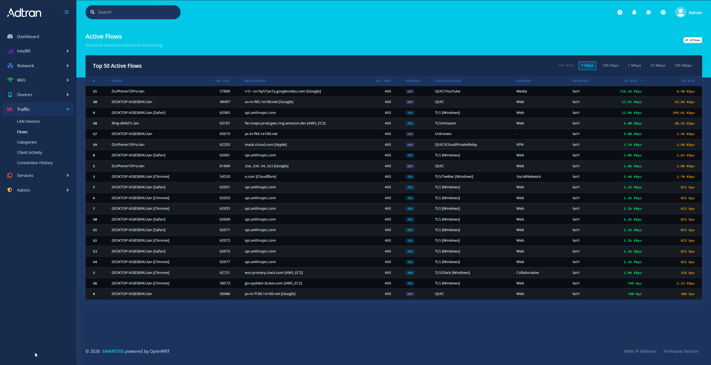

# FlowSight

A real-time network flow visualization tool for Intellifi SmartOS routers. Displays active connections on an interactive world map with DPI classification, risk scoring, traceroute hop analysis, and threat blocking.



## Features

- **Live flow map** - Active connections rendered as animated arcs on a dark-themed Leaflet world map with GeoIP-resolved endpoints
- **DPI classification** - Deep packet inspection via nDPI (classifi daemon) identifies application protocols (YouTube, Tailscale, iCloud, etc.)
- **Risk scoring** - nDPI risk analysis flags suspicious flows with severity levels (low/medium/high/severe) and specific risk types
- **Traceroute visualization** - On-demand MTR traces plotted hop-by-hop on the map with latency, jitter, and packet loss per hop
- **Multi-trace** - Trace up to 4 flows simultaneously with independent color-coded paths and comet/fuse animations
- **Sparkline rate history** - Inline SVG sparklines showing per-flow throughput trends over the last 20 samples
- **DSCP/QoS overlay** - Displays DSCP class markings (EF, AF41, CS3, etc.) on flows with QoS tagging
- **Threat blocking** - Block malicious IPs directly from the UI via nftables set rules with configurable duration (1h, 24h, reboot, permanent)
- **Historical trace comparison** - Compare current traceroute against previous runs, highlighting RTT deltas and path changes
- **WiFi client context** - Shows RSSI, band, channel, MCS, and PHY rates for wireless clients originating flows
- **Dark/light theme** - Toggle between dark and light map tiles and UI styling
- **Flow filtering** - Filter by minimum rate, category, protocol, or risk level

## Architecture

Single-page app with no build step:

| File | Purpose |
|------|---------|
| `index.html` | Shell markup, sidebar, flow list, map container, detail panel, trace panel |
| `app.js` | Flow rendering, Leaflet map, arc animations, traceroute, risk scoring, threat blocking |
| `styles.css` | All styling including dark/light themes, flow list, map popups, trace hop rows |

### Key Data Flow

1. **flowstatd** provides per-flow stats (rx/tx rates, byte counters) via ubus
2. **classifi** provides DPI classification (protocol, app, risk score) via ubus events
3. **GeoIP** resolves destination IPs to lat/lon coordinates for map placement
4. **MTR** runs on-demand traceroutes with JSON output for hop visualization

### Supporting Documentation

| File | Purpose |
|------|---------|
| `FIRMWARE_INTEGRATION.md` | Complete guide for SmartOS/OpenWrt firmware engineers to integrate the UI |
| `flowstatd.md` | Architecture and API reference for the flow statistics daemon |
| `flowstatd-modules.md` | Module breakdown of flowstatd (conntrack, stats, timeseries, ubus) |
| `classifi.md` | Architecture of the eBPF + nDPI deep packet inspection daemon |

## Running

Serve the directory with any static HTTP server:

```bash
python -m http.server 3456
```

Then open `http://localhost:3456` in a browser.

**Note**: GeoIP lookups use ip-api.com (rate-limited, requires internet). In production, use a local MaxMind GeoLite2 database.

## Dependencies

- [Leaflet 1.9.4](https://leafletjs.com) - Map rendering (loaded via CDN)
- [CartoDB Basemaps](https://carto.com/basemaps) - Dark/light map tiles

No npm, no build tools, no framework.
